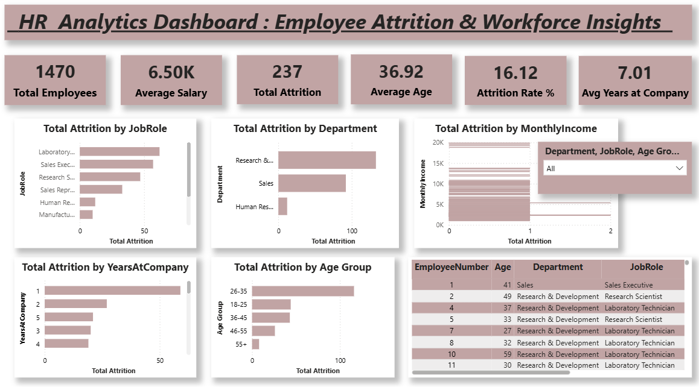

# HR Analytics Dashboard: Employee Attrition & Workforce Insights

## Project Overview

This project is a complete end-to-end HR Analytics solution designed to analyze employee attrition and workforce trends using real-world HR data. The goal of this project is to simulate how companies use data analytics and business intelligence tools to monitor employee retention, identify attrition patterns, and support data-driven HR decision-making.

Employee attrition is a critical business problem because losing employees increases recruitment costs, reduces productivity, and impacts organizational performance. This dashboard helps HR teams understand which employees are leaving, why they might be leaving, and which factors influence attrition the most.

This project demonstrates industry-level skills in data analysis, business intelligence, and dashboard development using Power BI.

## Dataset Information

**Dataset Name:** `hr-analytics-dataset.xslx`

The dataset contains employee-level information including:

- EmployeeNumber
- Age
- Department
- JobRole
- MonthlyIncome
- YearsAtCompany
- Attrition (Yes/No)
- and other workforce-related attributes

Each row represents one employee.

## Tools & Technologies Used

- Power BI – Dashboard creation and data visualization
- CSV – Data source
- Data Analytics & Business Intelligence concepts

## Key Performance Indicators (KPIs)

The dashboard calculates and displays important HR metrics such as:

- Total Employees
- Total Attrition (Employees who left)
- Attrition Rate (%)
- Average Employee Age
- Average Monthly Income
- Average Years at Company

These KPIs help organizations monitor workforce health and stability.

## Dashboard Features

The Power BI dashboard includes the following visualizations:

- Attrition by Department  
  Identifies which departments have the highest employee turnover.

- Attrition by Job Role  
  Shows which job roles are most affected by attrition.

- Attrition by Age Group  
  Helps identify age groups with higher attrition risk.

- Attrition by Salary (Monthly Income)  
  Analyzes how salary influences employee retention.

- Attrition by Years at Company  
  Helps understand when employees are most likely to leave.

- Employee-Level Attrition Table  
  Displays detailed employee information for deeper analysis.

- Interactive Filters (Slicers)
  - Filter by Department
  - Filter by Job Role
  - Filter by Age Group

Users can interact with the dashboard dynamically to explore insights.

## Business Insights Generated

This dashboard helps answer important business questions such as:

- Which department has the highest attrition?
- Which employees are at higher risk of leaving?
- Does salary impact attrition?
- Do employees leave early or after many years?
- Which age groups have higher attrition?

These insights help HR teams improve employee retention strategies.

## Files Included

hr-analytics-dataset.csv          → Dataset used for analysis
hr-analytics-dashboard.pbix      → Power BI dashboard file
hr-analytics.png                 → Dashboard screenshot
README.md                        → Project documentation

## Dashboard Preview

## Skills Demonstrated

This project demonstrates the following professional skills:

- Data Analysis
- HR Analytics
- Business Intelligence
- Power BI Dashboard Development
- KPI Analysis
- Attrition Analysis
- Data Visualization
- Real-world Business Problem Solving

## Project Outcome

This project simulates a real-world HR analytics workflow and demonstrates the ability to transform raw employee data into actionable business insights using Power BI. It showcases industry-level analytical thinking and dashboard development skills required for Data Analyst and Business Analyst roles.

## Author

Suhani  
